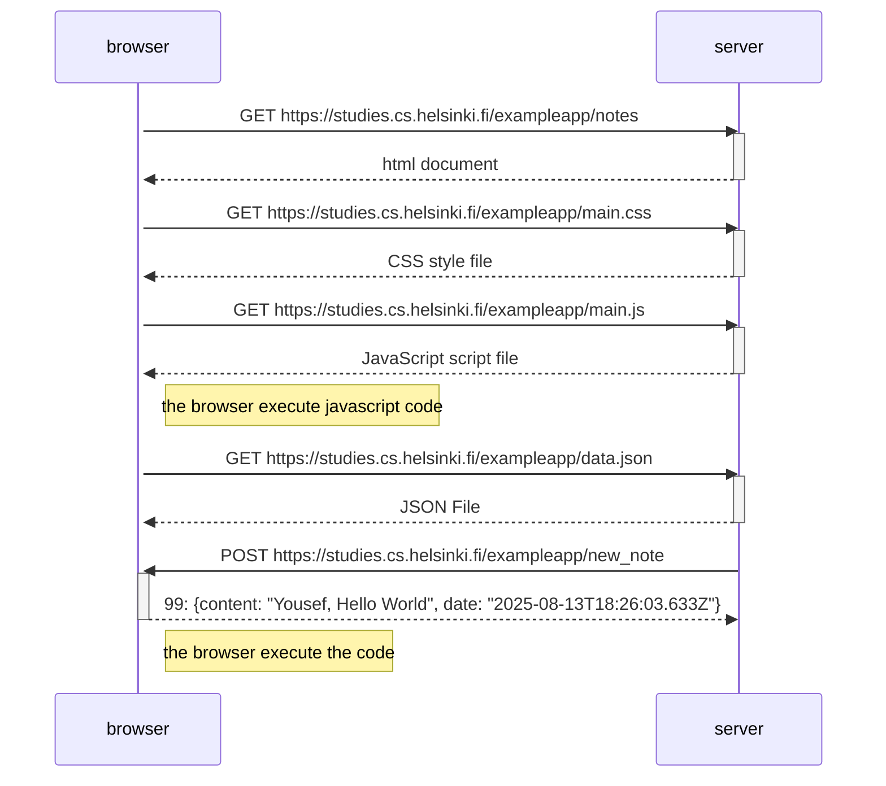

```mermaid
sequenceDiagram
    participant browser  
    participant server
    activate browser

    browser->>server: GET https://studies.cs.helsinki.fi/exampleapp/notes
    activate server
    server-->>browser: html document
    deactivate server

    browser->>server: GET https://studies.cs.helsinki.fi/exampleapp/main.css
    activate server
    server-->>browser: CSS style file
    deactivate server 


    browser->>server: GET https://studies.cs.helsinki.fi/exampleapp/main.js
    activate server
    server-->>browser: JavaScript script file
    deactivate server 

    Note right of browser:the browser execute javascript code

    browser->>server: GET https://studies.cs.helsinki.fi/exampleapp/data.json
    activate server
    server-->>browser: JSON File
    deactivate server 

    server->>browser: POST https://studies.cs.helsinki.fi/exampleapp/new_note
    activate browser
    browser-->>server: 99: {content: "Yousef, Hello World", date: "2025-08-13T18:26:03.633Z"}
    deactivate browser

    Note right of browser: the browser execute the code


```
