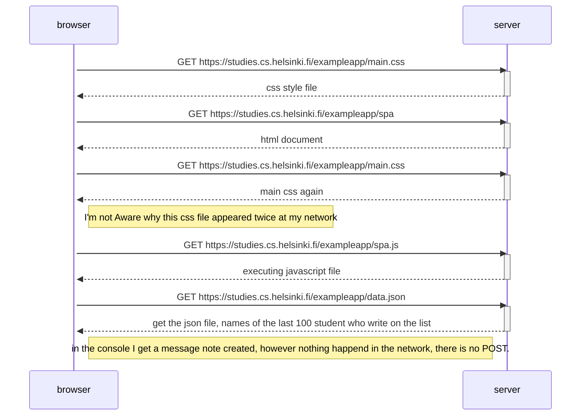

```mermaid
sequenceDiagram
    participant browser  
    participant server
    activate browser

    browser->>server: GET https://studies.cs.helsinki.fi/exampleapp/main.css
    activate server
    server-->>browser: css style file
    deactivate server

    browser->>server: GET https://studies.cs.helsinki.fi/exampleapp/spa
    activate server
    server-->>browser: html document
    deactivate server 


    browser->>server: GET https://studies.cs.helsinki.fi/exampleapp/main.css
    activate server
    server-->>browser: main css again
    deactivate server 

    Note right of browser:I'm not Aware why this css file appeared twice at my network

    browser->>server: GET https://studies.cs.helsinki.fi/exampleapp/spa.js
    activate server
    server-->>browser: executing javascript file
    deactivate server 


    browser->>server: GET https://studies.cs.helsinki.fi/exampleapp/data.json
    activate server
    server-->>browser: get the json file, names of the last 100 student who write on the list
    deactivate server 


    Note right of browser: in the console I get a message note created, however nothing happend in the network, there is no POST.


```
